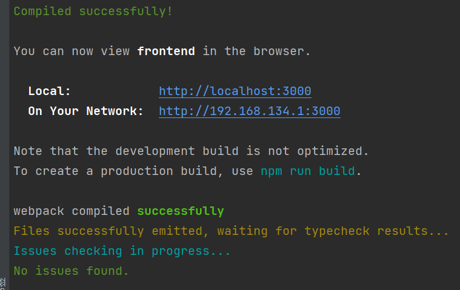

# ZJU-blockchain-course-2022

**以下内容为作业仓库的README.md中需要描述的内容。请根据自己的需要进行修改并提交。**

作业提交方式为：提交视频文件和仓库的连接到指定邮箱。

## 如何运行

1. 在本地启动ganache应用。

2. 在 `./contracts` 中安装需要的依赖，运行如下的命令：

   ```bash
   npm install
   ```

3. 在 `./contracts` 中编译合约，运行如下的命令：

   ```bash
   npx hardhat compile
   ```

4. 在 `./contracts` 中将合约部署在ganache网络上：

   ```
   npx hardhat run scripts/deploy.ts --network ganache
   ```

5. 将第4步所获得的三个地址更新在`./frontend/src/utils/contract-addresses.json`文件之中

   下图是已经更新好了的截图，注意检查`./frontend/src/utils/abis`之中的三个json文件是否与`./contracts/artifacts/contracts`之中的json文件一致

   )

6. 在 `./frontend` 中启动前端程序，运行如下的命令：

   ```bash
   npm run start
   ```

   顺利完成配置后会有如下内容显示，之后在安装了`matemask`的浏览器之中打开前端react页面，即可使用

   

## 功能实现分析

1. 完成了**以太坊的链接以及钱包的链接**，在页面上会显示钱包账户，钱包余额以及纪念品个数。

   这个部分主要是参考了lottery-demo之中的钱包以及web3初始化的基本模板，故大部分的代码都是助教老师提供的代码的使用，所以再次不做详细介绍。

2. 完成了”**每个学生初始可以通过某种方式拥有或领取一定的通政积分**（ECR20）“这个作业要求。
   这个部分参考了lottery-demo之中的申请zju-token的模块，和demo一样，一个学生账户在一次合约部署知州只能领取一次通政积分，领取额度是100，刷新后显示在通政积分余额之中，主要的思想是调用了MyECR20合约之中的airdrop()接口之中的_mint()功能。

3. 花费一定量的通政积分，**发起**有关社团活动以及进行制定规则的**提案**。

   这个部分是独立完成，每个学生可以在输入框内依次输入`提案名称`，`提案内容`，`持续时间（单位：分钟）` 这三个信息，之后点击提交即可将提案提交到平台上，平台对提案做展示。

   主要的实现方式是前端界面将输入框内收集到的三个信息以及系统当前的时间（系统自行记录），发起提案的账户（系统自行记录）传给智能合约，智能合约用proposal结构体接收信息（实例化）并存入内存，声明一个全局变量index来记录提案个数，每次有人post一个提案，则index++，这样就实现了提案提交的基本过程

   当然，提案提交是需要花费代价的，我将这个花费定义为10个通政积分，具体的花费方式是提交者A需要approve 10 个通政积分给社团管理系统这个智能合约的地址，之后如果有人成功获得通政积分（申请的提案通过了），也会从这个合约的地址直接拿到相应量的通政积分。在提交提案后，会收到提交成功的提示信息，这时候刷新页面，会发现通政积分少了10。到此，提案提交的过程基本结束。

4. 学生对提案进行**赞同和反对的投票**

   学生在浏览了提案列表后，可以选择提案序号然后选择支持或者反对，如果学生选择的提案已经过期或者提案序号不存在列表之中，那么就会返回错误信息。如果提案序号合法，就会相应的在proposal的结构体之中的approve或者object加1，这个结构体成员是之后判断是否提案通过的标准。

   Proposal结构如下所示：

   ```solidity
       struct Proposal {
           uint32 index;      // index of this proposal
           address proposer;  // who make this proposal
           uint256 startTime; // proposal start time
           uint256 duration;  // proposal duration
           string name;       // proposal name
           string text;
           uint32 approve;    //approval account
           uint32 object;  //objection account
           uint32 havedelt;
       }
   ```

   在这个过程之中，我还会采用一种数据结构来保证同学针对同一个提案的投票**不能超过两次**，这里采用一个映射关系，将同学，提案，投票次数相关联起来。voting数组将地址映射到一个数组之中，每个地址对应一个同学，也就是一个同学会对应一个数组，这个数组的第index个数，初始化为0，每次投票之后都会加1（不论是赞同还是反对），当为2时，也就是该同学针对第index个提案已经投票两次，之后的投票都会被deny掉，这在之后会进行演示。

   ```solidity
   mapping(address=>uint32[100])voting;
   voting[msg.sender][index_]+=1;
   ```

5. **投票时间**截止清算

   在前端界面里有一个结算按钮，点击结算按钮，后台会依次检查每个proposal的状态，如果`starttime+duration<current time` 则说明提案已经过期，针对过期提案我们会使用提案的成员变量`havedelt`来记录这个过期的提案是否已经被处理过了（处理指的是，赞同大于反对，就发钱，反对大于赞同，则什么都不做，这两个状态都会给用户相应提示）如果没处理过，就对提案进行处理，具体奖励方式在在6部分讲，如果处理过了，那就直接把他加到列表里就行。对于那些没过期的提案，直接加到列表里即可。

6. **奖励通政积分**-ERC20

   在初次结算每个已过期的提案的时候，我们会调用`StudentSocietyDAOContract.methods.getApproveTickets(i).call()` 以及

   `StudentSocietyDAOContract.methods.getObjectTickets(i).call()`来获取index为i的这个提案截至截止时间之后的赞同票数和反对票数。之后比较两者大小，如果反对大于等于赞同票（当然，两者都是0也相当于没通过），会给用户提示这个编号n的提案未通过。如果赞同票大于反对票，提案通过，反馈信息，并调用如下代码给这个提案的提出者

   ```solidity
   try {
   await StudentSocietyDAOContract.methods.reward(i).send({
   from: account
   })
   } catch (error: any) {
   alert(error.message)
   }
   alert('You have received the reward.')
   ```

   ```solidity
   function reward(uint32 index_) public {
           studentERC20.transfer(proposals[index_].proposer,5);
   }
   ```

   因为这个合约地址时有钱的，在学生提交提案的时候已经给了这个地址一些积分，所以这个操作就是把这个积分给那些通过提案的同学地址分发过去，规定一个提案通过给5个通政积分。之后同学会收到交易成功提示信息，交易完成，提案清算完成。

7. **奖励社团纪念品**-ERC721

   首先我们使用了一个映射来将地址映射为数字，来记录每一个同学已经通过的提案数量，初始化为0，每次有提案通过，就给提案提出者的数字加1

   ```solidity
   try {
   await StudentSocietyDAOContract.methods.approveNumberAdd(i).send({
   from: account
   })
   } catch (error: any) {
   alert(error.message)
   }
   alert('your approve num ++')
   ```

   然后检查该地址的approvenumber，如果大于等于3的话，我们就会给他发纪念品，

   ```solidity
   let number = await StudentSocietyDAOContract.methods.approveNumber(i).call();
   if (number >= 3) {
   try {
   await myERC721Contract.methods.awardSS(proposal_address, "https://ipfs.io/ipfs/QmVBVVvu9MacuaVckRxdNf2PvK7fxgg4p24gr5CJgjL9qz").send({
   from: account
   })
   alert('this student has already got the souvenir')
   } catch (error: any) {
   alert(error.message)
   }
   }
   else { }//do nothing
   ```

   在看myerc721智能合约之中的东西，这里有个小细节，一个人最多只能领取一次纪念品，所以我们用了一个映射数组来记录同学是否领取过纪念品，这个逻辑之前讲过，在此不做赘述。

   ```solidity
   function awardSS(address student,string memory tokenURI)public returns(uint256){
   require(alreadyGotSouvenir[msg.sender] == false, "This student has already got the souvenir");
   _tokenIds.increment();
   uint256 newSSId = _tokenIds.current();
   _mint(student,newSSId);
   _setTokenURI(newSSId,tokenURI);
   alreadyGotSouvenir[student]=true;
   return newSSId;
   }
   }
   ```

   这个发币遇上的麻烦是这个uri元数据链接，一开始不知道是什么东西，要写什么，之后上网查阅相关资料，在ipfs之中结合一个图片生成了一个uri的链接，转移到智能合约的代码之中，成功完成发纪念品的功能。


   以上就是基本功能的介绍，具体运行截图如下所示。

​		

## 项目运行截图

1. 登陆界面：

   

   

2. 连接钱包之后：

   

   之后我们领取通政积分

   

   

   再次领取通政积分会报错

   

3. 之后我们测试提交提案的功能
   在输入框我们会有输入信息的提示，用户可以根据提示来书写提案

   

   用户完成信息的输入，并点击提交提案按钮

   

   这个提交提案的交易会记录在区块链之中

   

   提交成功之后会显示提示信息，包括你提交提案的序号也会提示在内

   

   提交成功之后刷新页面，可以看到你的提案在提案列表之中，同时包括是否过期的信息

   

   我们可以看到，因为每次提交提案需要花费10个代币，所以此时可以看到剩余的通政积分还剩90

   

   

4. 投票功能：
   之后测试我们的投票功能，如果我们在投票栏输入的index不在范围之内，会弹出错误信息，如图所示

   

   我们选择index为1，也就是刚才提交到提案来投票，投票行为会记录在区块链上

   

   投票成功之后会显示投票成功后的提示信息

   

   第二次投票过程与第一次相同，在此略过第二次投票过程

   在我们进行第三次投票的过程之中，以太坊交易会报错并弹出错误信息，如下图所示

   

   

5. 刷新结算功能：

   五分钟之后我们刷新页面可以看到，该提案的过期状态已经变为“已过期”，在这个时候我们点击结算按钮，就会收到合约给提案者奖励的ERC20代币

   

   这个交易开始界面如上，完成交易后代币结果以及提示信息如下，确实是95没错

   

   

   

   补充说明，当我们提案没有通过的话，我们也会显示信息，如下图所示

   

6. 发送纪念品功能：
   当三个提案都通过之后，提案者会收到一个纪念品，具体的代码可以看上一个部分陈述，也可以去源代码的MyERC721合约之后看

   

   

   之后再有新的提案被同意通过也无法在获得纪念品了，会弹出错误信息，因为我在这里定义该纪念品一人至多一个。

   以上就是所有关键功能的截图，如有疑问可以移步源码或者部署工程亲自体验。万分感谢。

## 参考内容

课程的参考Demo见：[DEMOs](https://github.com/LBruyne/blockchain-course-demos)。

如果有其它参考的内容，也请在这里陈列。
